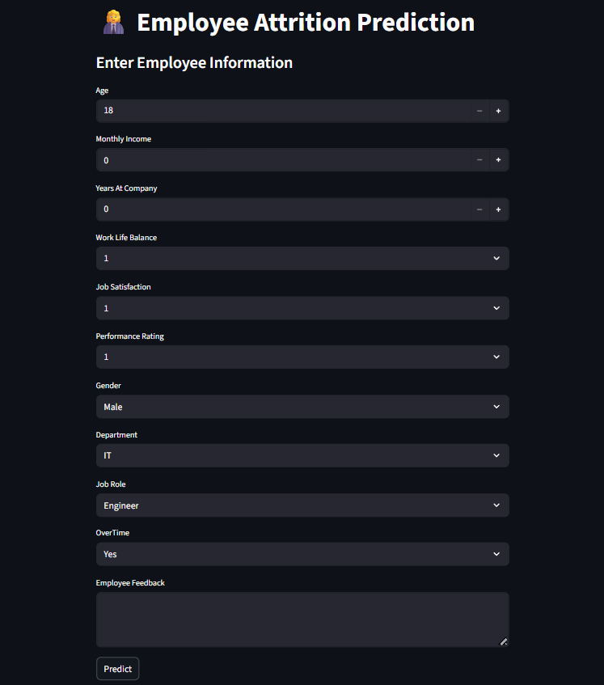
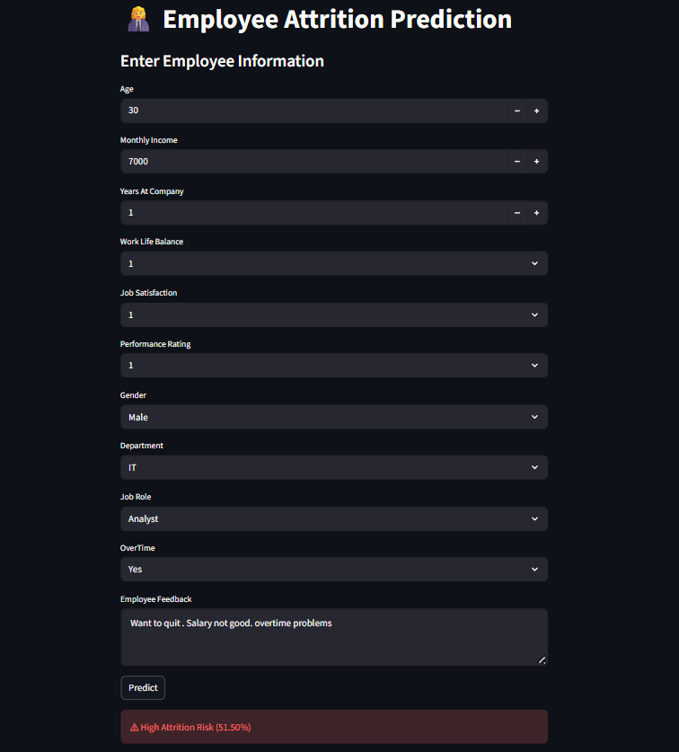

# Employee Attrition Prediction using Machine Learning

A complete end-to-end **Machine Learning + Streamlit** project that predicts whether an employee is likely to leave an organization based on demographic, job-related, and feedback data.

This project demonstrates data preprocessing, feature engineering, handling class imbalance, model training, and deployment using a clean ML pipeline.

---

## 🚀 Project Overview

Employee attrition is a major challenge for organizations. This application predicts attrition risk and provides real-time predictions through a Streamlit interface.

---

## 📸 Application Screenshots

### Input Form


### Prediction Result



### Key Features
- ML pipeline using **scikit-learn**
- Numerical, categorical, and text feature handling
- Class imbalance handling with **SMOTE**
- Dimensionality reduction using **PCA**
- Interactive UI with **Streamlit**
- Reproducible and deployment-ready setup

---

## 🧠 Machine Learning Pipeline

- Data imputation and scaling
- One-hot encoding for categorical features
- TF-IDF vectorization for text feedback
- SMOTE for class balancing
- PCA for dimensionality reduction
- Random Forest classifier

The model is retrained automatically if a saved pipeline is not found.

---

## 🛠 Tech Stack

- Python
- Pandas, NumPy
- Scikit-learn
- Imbalanced-learn
- Streamlit

---

## 📂 Project Structure

```
Employee_Attrition_ML/
├── app.py
├── requirements.txt
├── employee_attrition.csv
├── .gitignore
└── README.md
```

> The trained model file (`.pkl`) is intentionally not committed.

---

## ▶️ How to Run

```bash
pip install -r requirements.txt
streamlit run app.py
```

---

## 📊 Input & Output

**Inputs**
- Numerical: Age, Monthly Income, Years at Company, Work-Life Balance, Job Satisfaction, Performance Rating
- Categorical: Gender, Department, Job Role, OverTime
- Text: Employee Feedback

**Output**
- Attrition risk prediction with probability score(High Risk/Low Risk)

---

## 👤 Author

**Vyshnav S**  
GitHub: https://github.com/Vyshnav-S

---

## 📄 License

This project is for educational and demonstration purposes.
